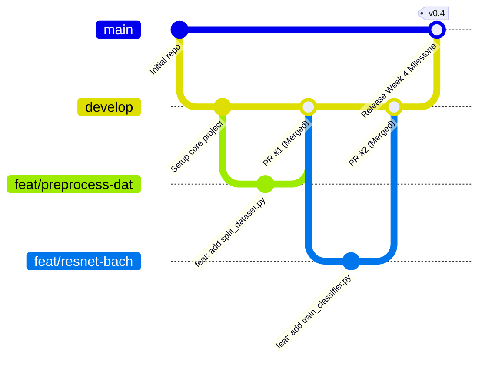
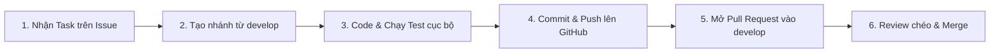

# 🤝 Hướng Dẫn Đóng Góp & Quy Chuẩn Phối Hợp Nhóm (Contributing Guide)

Tài liệu này quy định toàn bộ nguyên tắc làm việc, quản lý mã nguồn, chiến lược phân nhánh và quy chuẩn viết mã cho 4 thành viên thực hiện **Đồ án 2 — Xây dựng Hệ thống Thị giác Máy tính Phân loại và Nhận diện Phương tiện Giao thông** (Khoa CNTT - Trường Đại học Mỏ - Địa chất).

---

## 👥 1. Danh sách Thành viên & Phân công Trách nhiệm

| STT | Thành viên | Vai trò | Phụ trách chính |
| :---: | :--- | :--- | :--- |
| 1 | **Nguyễn Thành Đạt** | Trưởng nhóm (Leader) | Quản trị GitHub Repo, điều phối tiến độ, thiết kế pipeline, module đánh giá (`evaluate.py`), review & merge mã nguồn chính |
| 2 | **Đỗ Xuân Bách** | Kỹ sư Dữ liệu & Baseline | Tiền kiểm tra & làm sạch dữ liệu, module tăng cường ảnh (`augmentation.py`), mô hình phân loại ResNet50, YOLOv8n |
| 3 | **Nguyễn Vũ Tùng** | Kỹ sư Hạ tầng & Mô hình | Thu thập video thực tế, Letterboxing (`preprocessing.py`), mô hình nhẹ MobileNetV3-Large, YOLOv8s/m, ONNX Export |
| 4 | **Phạm Văn Tưởng** | Kỹ sư Nghiên cứu & Báo cáo | Nghiên cứu lý thuyết CNN/YOLO, thử nghiệm Mosaic & MixUp (`mosaic_mixup.py`), Notebooks EDA & Visualization, tổng hợp báo cáo |

---

## 🌿 2. Chiến lược Phân nhánh (Git Flow Strategy)

Nhóm áp dụng mô hình phân nhánh tiêu chuẩn **Git Flow** nhằm đảm bảo mã nguồn luôn ổn định và không xảy ra xung đột:



### 2.1. Cấu trúc các nhánh chính
1. **`main`**: Nhánh phát hành ổn định nhất của dự án.
   - Chỉ chứa các phiên bản đã được kiểm thử kỹ lưỡng và nghiệm thu ở từng mốc tuần.
   - **Tuyệt đối không push trực tiếp lên `main`**.
2. **`develop`**: Nhánh tích hợp mã nguồn chính của nhóm.
   - Tất cả các tính năng sau khi hoàn thành sẽ được tạo Pull Request để merge vào đây.
3. **Nhánh cá nhân (Feature/Fix/Docs Branches)**:
   - Nhánh do từng thành viên tạo ra từ `develop` để thực hiện nhiệm vụ được giao.

### 2.2. Quy chuẩn đặt tên nhánh
Tên nhánh viết bằng **chữ thường**, các từ ngăn cách bằng dấu gạch ngang `-`, theo cú pháp:

```text
<loại-nhánh>/<tuần>-<tên-thành-viên>-<tên-nhiệm-vụ>
```

- **Ví dụ nhánh tính năng:**
  - `feat/w3-dat-split-dataset`
  - `feat/w3-bach-albumentations`
  - `feat/w3-tung-letterbox`
  - `feat/w3-tuong-mosaic-mixup`
  - `feat/w4-bach-resnet50-baseline`
  - `feat/w4-tung-mobilenetv3`
- **Ví dụ nhánh sửa lỗi:**
  - `fix/w3-fix-bbox-clip`
  - `fix/w4-cuda-oom-colab`
- **Ví dụ nhánh tài liệu:**
  - `docs/w3-4-progress-report`
  - `docs/update-labeling-standard`

---

## 💬 3. Quy chuẩn Viết Commit Message (Conventional Commits)

Mỗi commit phải mang một ý nghĩa rõ ràng, súc tích và tuân thủ định dạng chuẩn quốc tế:

```text
<type>(<scope>): <mô tả ngắn gọn bằng tiếng Việt hoặc tiếng Anh>
```

### 3.1. Các loại tiền tố (`type`):
- `feat`: Thêm một tính năng hoặc module mã nguồn mới.
- `fix`: Sửa lỗi mã nguồn hoặc logic xử lý.
- `data`: Xử lý nhãn, chia tập dữ liệu hoặc thay đổi cấu hình dữ liệu (`data.yaml`).
- `model`: Huấn luyện mô hình, tinh chỉnh siêu tham số, xuất ONNX.
- `docs`: Thêm hoặc chỉnh sửa tài liệu, báo cáo tuần, README.
- `refactor`: Tối ưu hóa hoặc tái cấu trúc mã nguồn (không làm thay đổi tính năng).
- `test`: Thêm hoặc sửa kịch bản kiểm thử, demo validation.
- `chore`: Cấu hình môi trường, cài đặt thư viện (`requirements.txt`), cập nhật file Git.

### 3.2. Ví dụ commit mẫu:
- `feat(preprocessing): thêm hàm letterbox resize 640x640 giữ nguyên tỷ lệ`
- `feat(classifier): xây dựng mạng resnet50 với 2 giai đoạn freeze và unfreeze`
- `fix(augmentation): sửa lỗi bounding box bị âm khi xoay ảnh góc nhỏ`
- `docs(report): hoàn thành bản thảo báo cáo tiến độ tuần 3 và tuần 4`
- `chore: cập nhật requirements.txt bổ sung opencv và albumentations`

---

## 🚫 4. Quy tắc Bắt buộc: Quản lý Dữ liệu Lớn & Trọng số Mô hình

Để tránh làm phình dung lượng kho lưu trữ Git và vi phạm chính sách giới hạn file của GitHub (tối đa 100MB/file):

> [!CAUTION]
> **NGHIÊM CẤM COMMIT VÀO GITHUB:**
> - Toàn bộ ảnh hoặc video trong `data/raw/`, `data/train/`, `data/val/`, `data/test/`.
> - Tệp nén dữ liệu (`*.zip`, `*.tar.gz`, `*.rar`).
> - Tệp trọng số mô hình lớn (`*.pt`, `*.pth`, `*.onnx`, `*.bin`).
> - Tệp nhật ký huấn luyện quá lớn (`runs/`, `wandb/`).

### Phương thức lưu trữ dữ liệu và Model Weights:
1. **Google Drive của nhóm:** Lưu trữ dữ liệu gốc và các bản backup dataset tại thư mục Google Drive:  
   `DoAn2_Vehicle_Classification/data/`
2. **Checkpoint mô hình:** Các file trọng số tốt nhất (`best.pt`, `resnet50_best.pth`) sau khi train trên Colab sẽ được tự động lưu về Google Drive hoặc đính kèm vào mục **GitHub Releases** khi hoàn thành mốc tuần.
3. Luôn đảm bảo tệp `.gitignore` đang hoạt động trước khi chạy `git add .`.

---

## 🔄 5. Quy trình Làm việc 6 Bước cho Thành viên Nhóm



### Bước 1: Nhận nhiệm vụ trên GitHub Issues
- Vào mục **Issues** trên GitHub repository.
- Tìm Issue của tuần hiện tại hoặc tạo mới Issue bằng mẫu `[TASK-Tuần X]`.
- Gán tên mình vào phần **Assignee**.

### Bước 2: Kéo mã nguồn mới nhất và tạo nhánh
```bash
# 1. Chuyển sang nhánh develop và lấy code mới nhất
git checkout develop
git pull origin develop

# 2. Tạo nhánh mới cho nhiệm vụ của mình
git checkout -b feat/w3-dat-split-dataset
```

### Bước 3: Lập trình và kiểm thử cục bộ
- Viết mã nguồn vào thư mục `src/`, tuân thủ docstring và hướng dẫn của từng file.
- Chạy thử nghiệm để chắc chắn mã không báo lỗi cú pháp:
```bash
# Kiểm tra cú pháp
python -m py_compile src/tên_file_vừa_viết.py

# Chạy thử demo (nếu có cờ --demo)
python src/tên_file_vừa_viết.py --demo
```

### Bước 4: Lưu thay đổi và đẩy lên GitHub
```bash
# Kiểm tra các tệp đã sửa đổi (chắc chắn không có tệp rác hay dữ liệu nặng)
git status

# Đưa tệp vào staging
git add src/split_dataset.py

# Commit theo chuẩn Conventional Commits
git commit -m "feat(split): hoàn thành phân chia stratified 70/20/10 trên tập dữ liệu 9434 ảnh"

# Đẩy nhánh lên GitHub
git push -u origin feat/w3-dat-split-dataset
```

### Bước 5: Mở Pull Request (PR)
- Truy cập vào giao diện GitHub Repository, bấm nút **Compare & pull request**.
- **Base branch (Nhánh đích):** Chọn `develop` *(KHÔNG chọn `main`)*.
- **Compare branch:** Chọn nhánh cá nhân của bạn.
- Điền đầy đủ thông tin theo mẫu **Pull Request Template** đã được tạo sẵn.
- Tag đồng đội vào mục **Reviewers** để nhờ duyệt.

### Bước 6: Review chéo (Peer Review) & Hợp nhất mã nguồn
- Thành viên được chỉ định review sẽ kiểm tra mã nguồn trên tab **Files changed**.
- Nếu phát hiện vấn đề: Để lại comment yêu cầu sửa đổi.
- Nếu đạt yêu cầu: Bấm **Approve**.
- Trưởng nhóm (Nguyễn Thành Đạt) hoặc người phụ trách sẽ thực hiện **Squash and merge** nhánh vào `develop`.
- Xóa nhánh cá nhân sau khi merge để giữ kho repo gọn gàng.

---

## 🎯 6. Tiêu chí Đánh giá & Duyệt Code (Code Review Checklist)

Mọi Pull Request trước khi được duyệt phải đạt các tiêu chí sau:

1. [x] **Tính hoạt động:** Mã nguồn chạy được độc lập hoặc tích hợp không phát sinh lỗi exception.
2. [x] **Chuẩn hóa giao diện CLI:** Các script chính có cờ `--help`, sử dụng thư viện `argparse`.
3. [x] **Bảo toàn dữ liệu:** Không làm thay đổi cấu trúc dataset ngoài ý muốn, bảo toàn định dạng tọa độ bounding box YOLO `[0.0, 1.0]`.
4. [x] **Clean Code:** Tên hàm, biến viết bằng tiếng Anh rõ nghĩa (`camelCase` hoặc `snake_case`), có docstring mô tả tham số đầu vào và kết quả trả về.
5. [x] **Clean Git:** Không commit file tạm (`.DS_Store`, `__pycache__`, `.ipynb_checkpoints`).
